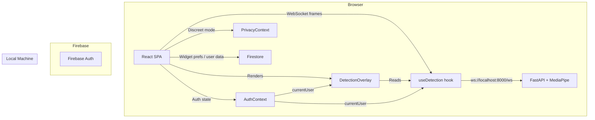

# Design Document — StrandSmart Full Redesign

## Overview

This document describes the technical design for the full StrandSmart redesign. StrandSmart is a React 18 + Firebase single-page application that helps people managing trichotillomania track urges, practice grounding exercises, and optionally use a local computer-vision (CV) backend for real-time hand-to-face proximity detection.

The redesign touches every major surface of the app: auth pages, a new onboarding modal, dashboard restructuring, privacy infrastructure, discreet mode overhaul, grounding exercise improvements, a new settings page, CV detection auth-gating, and a README rewrite. The CV backend (`backend/main.py`) is a FastAPI + MediaPipe server that runs entirely on localhost — no video or biometric data ever leaves the device.

### Key Design Principles

- **Privacy-first**: All CV processing is local. No frames, images, or biometric data are transmitted.
- **Incremental change**: The redesign builds on the existing React component tree, routing structure, and Firebase integration rather than replacing them wholesale.
- **Discreet by design**: Discreet Mode must transform the app completely enough that it is unrecognizable as a mental-health tool.
- **Auth-gated CV**: The WebSocket connection and camera access must never activate for unauthenticated sessions.

---

## Architecture

The app follows a standard React SPA architecture with Firebase as the cloud backend and a local FastAPI server for CV processing.



### New Routes Added by This Redesign

| Route | Component | Auth Required |
|---|---|---|
| `/settings` | `SettingsPage` | Yes |
| `/privacy` | `PrivacyPage` | No |
| `/terms` | `TermsPage` | No |

### Existing Routes Modified

| Route | Changes |
|---|---|
| `/login-page` | Dark green background, email validation |
| `/register-page` | Dark green background, email validation, Terms checkbox |
| `/` (Index) | Remove ReactTyped animation |
| `/dashboard` | CV hero card, widget toggles, warm empty states, reflections section |
| `/grounding` | Difficulty selector, overflow fix, progress indicators, completion screen |

---

## Components and Interfaces

### New Components

#### `OnboardingModal`

A 3-screen modal shown once to first-time users after login.

```
Props: { isOpen: bool, onComplete: () => void, onDismiss: () => void }

Screen 1: Welcome — warm plain-English description of StrandSmart
Screen 2: Privacy — explicit local-processing statement + pipeline diagram
Screen 3: Paths — "Use without CV" | "Enable CV detection" + setup instructions
```

State: `currentScreen: 0 | 1 | 2`

On complete/dismiss: calls `setDoc(doc(db, "users", uid), { onboardingComplete: true }, { merge: true })` then invokes `onComplete`.

#### `SettingsPage`

A new protected route at `/settings` with six collapsible sections.

```
Sections:
  Profile     — display name, email edit
  Dashboard   — widget visibility toggles (6 widgets)
  Data        — log list, delete individual, delete all, export CSV, delete account
  Preferences — default grounding difficulty, alert suppression duration
  CV Detection — enable/disable toggle, sensitivity slider, privacy link, local-log note
  Onboarding  — "Revisit onboarding" button
```

#### `PrivacyPage`

Static page at `/privacy`. No auth required. Contains:
- What is collected (urge logs, timestamps, intensity)
- What is never collected (video, images, biometric data)
- Where data lives (Firestore, deletable at any time)
- CV processing is entirely local

#### `TermsPage`

Placeholder static page at `/terms`. No auth required.

#### `PrivacyBanner`

A non-blocking overlay shown once per browser session when the camera first activates.

```
Props: { onDismiss: () => void }
Condition: localStorage.getItem("ss_camera_banner_dismissed") !== "true"
On dismiss: localStorage.setItem("ss_camera_banner_dismissed", "true")
```

#### `CVStatusCard`

The hero card on the Dashboard showing CV connection state.

```
Props: { isConnected: bool }

isConnected=true:  camera active indicator, "CV Connected" label, live pulse animation
isConnected=false: friendly explainer text, "Set up CV detection" button → /settings#cv-detection
```

#### `GroundingCompletionScreen`

Shown when a grounding exercise session ends.

```
Props: { duration: string, onLogUrge: () => void, onBackToDashboard: () => void }

Message format: "Nice work. Your hands stayed busy for [duration]."
Actions: "Log an urge" | "Back to dashboard"
```

#### `DifficultySelector`

Shown on the Strand Flow tab before the canvas session begins.

```
Props: { value: "beginner" | "intermediate" | "advanced", onChange: (v) => void }
Persists selection to localStorage key: "ss_grounding_difficulty"
```

### Modified Components

#### `PrivacyContext`

**Current**: Manages `discreetMode` toggle and a `LABEL_MAP` with partial label coverage.

**Changes**:
- Expand `LABEL_MAP` to cover all required label substitutions:
  - `"Log Urge"` → `"New Note"`
  - `"Grounding"` → `"Focus"`
  - `"Dashboard"` → `"Notes"`
  - `"StrandSmart"` → `"Notes"`
- When `discreetMode` is active, apply a full white/black CSS variable set (not just blue-gray)
- Add `cvEnabled: bool` state (default `true`) to control whether `useDetection` opens a WebSocket

#### `useDetection`

**Current**: Always opens a WebSocket on mount, regardless of auth state.

**Changes**:
- Accept `enabled: bool` prop (from `PrivacyContext.cvEnabled`). When `false`, do not open WebSocket and do not start camera.
- Accept `currentUser` from `AuthContext`. When `null`, do not open WebSocket.
- On sign-out (`currentUser` transitions to `null`), close the WebSocket and stop the frame interval.
- Expose `pauseFrames` behavior when `discreetMode` is true (already implemented via `discreetRef`).

#### `DetectionOverlay`

**Current**: Always mounts and calls `useDetection` unconditionally.

**Changes**:
- Read `currentUser` from `AuthContext`. If `null`, render nothing.
- Read `cvEnabled` from `PrivacyContext`. If `false`, render nothing.
- Pass `suppressDuration` (from user preferences, default 5 min) to the dismiss handler.
- Remove the `DebugBadge` from production builds (or gate it behind a `process.env.NODE_ENV === "development"` check).

#### `ExamplesNavbar`

**Changes**:
- Replace the text-labeled "Discreet" button with an icon-only button using an iOS share-style icon (`fa-arrow-up-from-bracket` or equivalent).
- Add `aria-label="Toggle discreet mode"` to the button.
- Show filled vs. outline icon state based on `discreetMode`.
- Add a link to `/settings` for authenticated users.

#### `Dashboard`

**Changes**:
- Move `VibeInput` out of the main layout; replace with a "Reflections" navigation card.
- Add `CVStatusCard` as the first element below the welcome header.
- Wrap each widget in a visibility check against user preferences from Firestore.
- Update all empty state messages to warm, encouraging copy.
- Apply solid navbar background immediately (no scroll threshold).

#### `FidgetCanvas`

**Changes**:
- Accept `difficulty: "beginner" | "intermediate" | "advanced"` prop.
- Map difficulty to `PROXIMITY_R` and pulse speed:
  - Beginner: `PROXIMITY_R * 1.5`, speed `* 0.7`
  - Intermediate: current defaults
  - Advanced: `PROXIMITY_R * 0.65`, speed `* 1.4`

#### `LoginPage` / `RegisterPage`

**Changes**:
- Replace the BLK `page-header-image` background with `background: #0d2b1a`.
- Add client-side email validation using regex `^[^\s@]+@[^\s@]+\.[^\s@]+$`.
- Display inline error below the email field on invalid submission.
- Clear the error when the email field changes to a valid value.
- `RegisterPage`: add Terms checkbox with link to `/terms`; block submission if unchecked.

#### `Footer`

**Changes**:
- Add a link to `/privacy`.

---

## Data Models

### Firestore — User Document (`users/{uid}`)

```typescript
interface UserDocument {
  uid: string;
  displayName: string;
  email: string;
  createdAt: Timestamp;

  // Added by this redesign:
  onboardingComplete?: boolean;          // set to true after first onboarding
  widgetPreferences?: WidgetPreferences; // dashboard widget visibility
  preferences?: UserPreferences;         // grounding difficulty, alert suppression
}

interface WidgetPreferences {
  urgeTracker:       boolean; // default: true
  insightsChart:     boolean; // default: true
  recentLogs:        boolean; // default: true
  safeStreak:        boolean; // default: true
  dailyInspiration:  boolean; // default: true
  recentReflections: boolean; // default: true
}

interface UserPreferences {
  defaultGroundingDifficulty: "beginner" | "intermediate" | "advanced"; // default: "intermediate"
  alertSuppressionMinutes: number; // default: 5, range: 1–60
}
```

### Firestore — Urge Log (`users/{uid}/logs/{logId}`)

Existing schema — no changes required:

```typescript
interface UrgeLog {
  id: string;
  loggedAt: Timestamp;
  intensity?: number;
  note?: string;
}
```

### localStorage Keys

| Key | Type | Purpose |
|---|---|---|
| `ss_discreet` | `"true" \| "false"` | Discreet mode persistence (existing) |
| `ss_camera_banner_dismissed` | `"true"` | Privacy banner one-time dismiss |
| `ss_grounding_difficulty` | `"beginner" \| "intermediate" \| "advanced"` | Last selected difficulty |
| `ss_cv_enabled` | `"true" \| "false"` | CV detection enabled state |

### CSV Export Format

```
timestamp,intensity,note
2024-01-15T14:32:00Z,7,"Felt stressed after meeting"
2024-01-15T09:15:00Z,4,""
```

Filename format: `strandsmart-logs-YYYY-MM-DD.csv` (date = export date)

---

## Correctness Properties

*A property is a characteristic or behavior that should hold true across all valid executions of a system — essentially, a formal statement about what the system should do. Properties serve as the bridge between human-readable specifications and machine-verifiable correctness guarantees.*

### Property 1: Email validation rejects all non-email strings

*For any* string that does not match the pattern `^[^\s@]+@[^\s@]+\.[^\s@]+$`, submitting it as an email in either the sign-in or sign-up form SHALL prevent form submission and display an inline error message.

**Validates: Requirements 2.1, 2.2**

---

### Property 2: Email validation error clears on valid input

*For any* email input field that is currently showing a validation error, changing the value to a string that matches the email regex SHALL clear the inline error.

**Validates: Requirements 2.3**

---

### Property 3: Widget visibility is a round-trip

*For any* widget in the set {Urge Tracker, Insights Chart, Recent Logs, Safe Streak, Daily Inspiration, Recent Reflections}, disabling it SHALL remove it from the Dashboard, and subsequently re-enabling it SHALL restore it to the Dashboard.

**Validates: Requirements 8.3, 8.4**

---

### Property 4: Empty states never contain "no data"

*For any* dashboard widget rendered with an empty data set, the rendered output SHALL NOT contain the substring "no data" or "no data yet" (case-insensitive).

**Validates: Requirements 9.4**

---

### Property 5: Privacy banner dismiss is persistent

*For any* browser session where the Privacy Banner has been dismissed (localStorage key `ss_camera_banner_dismissed` is set), re-rendering the component that conditionally shows the banner SHALL NOT display the banner.

**Validates: Requirements 12.2**

---

### Property 6: CSV export contains all required fields for every log

*For any* non-empty array of Urge Log objects, the CSV string generated by the export function SHALL contain a row for each log, and each row SHALL include the `timestamp`, `intensity`, and `note` fields.

**Validates: Requirements 15.3**

---

### Property 7: Discreet mode label substitution is exhaustive

*For any* string key present in the `LABEL_MAP` (covering "StrandSmart", "Log Urge", "Grounding", "Dashboard"), calling `label(key)` with `discreetMode === true` SHALL return the mapped replacement value, and calling it with `discreetMode === false` SHALL return the original key unchanged.

**Validates: Requirements 17.4, 17.5, 17.6, 17.7**

---

### Property 8: Difficulty selector maps to correct FidgetCanvas configuration

*For any* difficulty value in {"beginner", "intermediate", "advanced"}, selecting that difficulty SHALL result in `FidgetCanvas` receiving a `PROXIMITY_R` value and pulse speed that are strictly ordered: Beginner > Intermediate > Advanced for proximity tolerance, and Beginner < Intermediate < Advanced for speed.

**Validates: Requirements 19.2, 19.3, 19.4**

---

### Property 9: Default difficulty preference pre-selects on Grounding page

*For any* difficulty value in {"beginner", "intermediate", "advanced"} saved as the user's default preference, navigating to the Grounding page SHALL pre-select that difficulty in the `DifficultySelector` component.

**Validates: Requirements 26.2**

---

### Property 10: Alert suppression duration is respected

*For any* suppression duration value `d` in the range [1, 60] minutes, after a CV alert is dismissed, no new alert vignette SHALL appear for at least `d` minutes, regardless of how many proximity events the CV backend reports during that window.

**Validates: Requirements 26.4**

---

## Error Handling

### Auth Errors

- Firebase Auth errors are mapped to user-friendly messages in `friendlyAuthError()` (already implemented in `LoginPage` and `RegisterPage`).
- Email re-authentication errors (e.g., `auth/requires-recent-login`) during email update or account deletion are surfaced with a descriptive message prompting the user to sign out and sign back in.

### CV Backend Offline

- `useDetection` handles WebSocket connection failures gracefully: `isConnected` stays `false`, no errors are thrown, reconnect is attempted every 3 seconds.
- The Dashboard `CVStatusCard` shows the friendly offline state when `isConnected === false`.

### Firestore Errors

- Account deletion: if any Firestore delete call fails, the entire deletion is aborted, an error message is shown, and the Firebase Auth account is NOT deleted (fail-safe).
- Widget preference writes: failures are logged to console but do not block the UI. Preferences fall back to defaults on next load.
- Onboarding completion write: failure is logged but does not block navigation to the Dashboard. The modal will re-appear on next login, which is acceptable.

### CSV Export Errors

- If Firestore query fails during export, an error toast is shown and no download is triggered.
- If the user has no logs, a CSV with only the header row is downloaded.

### Account Deletion — Two-Step Confirmation

```
Step 1: Modal — "This will permanently delete your account and all data. This cannot be undone."
         [Cancel] [Continue]

Step 2: Modal — "Type DELETE to confirm."
         [text input]
         [Cancel] [Delete my account]
```

Only after both steps pass does the deletion sequence begin:
1. Delete all documents in `users/{uid}/logs/`
2. Delete the `users/{uid}` document
3. Delete the Firebase Auth account
4. Call `signOut(auth)`
5. Navigate to `/`

---

## Testing Strategy

### Unit Tests (React Testing Library + Jest)

Unit tests cover specific examples, edge cases, and error conditions. The project uses `react-scripts test` which runs Jest under the hood.

Focus areas:
- `OnboardingModal`: screen navigation, Firestore write on completion, conditional rendering based on `onboardingComplete`
- `SettingsPage`: section rendering, profile update calls, data export, account deletion flow
- `CVStatusCard`: connected vs. disconnected states
- `PrivacyBanner`: localStorage-gated rendering, dismiss behavior
- `DetectionOverlay`: auth-gated rendering, suppression timer
- `useDetection`: auth-gated WebSocket, discreet mode frame pausing, sign-out cleanup
- Auth pages: email validation, Terms checkbox, background color

### Property-Based Tests

The project uses **fast-check** for property-based testing. Install with:

```bash
npm install --save-dev fast-check
```

Each property test runs a minimum of **100 iterations**. Tests are tagged with a comment referencing the design property.

**Property 1 — Email validation rejects all non-email strings**
```javascript
// Feature: strandsmart-full-redesign, Property 1: email validation rejects non-email strings
fc.assert(fc.property(
  fc.string().filter(s => !EMAIL_REGEX.test(s)),
  (invalidEmail) => {
    // render form, set email to invalidEmail, submit
    // assert: error message is shown, Firebase auth not called
  }
), { numRuns: 100 });
```

**Property 2 — Email validation error clears on valid input**
```javascript
// Feature: strandsmart-full-redesign, Property 2: email validation error clears on valid input
fc.assert(fc.property(
  fc.emailAddress(),
  (validEmail) => {
    // render form with existing error state, set email to validEmail
    // assert: error message is absent
  }
), { numRuns: 100 });
```

**Property 3 — Widget visibility round-trip**
```javascript
// Feature: strandsmart-full-redesign, Property 3: widget visibility is a round-trip
fc.assert(fc.property(
  fc.constantFrom("urgeTracker", "insightsChart", "recentLogs", "safeStreak", "dailyInspiration", "recentReflections"),
  (widgetKey) => {
    // render Dashboard with widget disabled
    // assert: widget not in DOM
    // re-enable widget
    // assert: widget in DOM
  }
), { numRuns: 100 });
```

**Property 4 — Empty states never contain "no data"**
```javascript
// Feature: strandsmart-full-redesign, Property 4: empty states never contain "no data"
fc.assert(fc.property(
  fc.constantFrom("recentLogs", "insightsChart", "safeStreak"),
  (widgetKey) => {
    // render widget with empty data
    // assert: rendered text does not contain "no data" or "no data yet" (case-insensitive)
  }
), { numRuns: 100 });
```

**Property 5 — Privacy banner dismiss is persistent**
```javascript
// Feature: strandsmart-full-redesign, Property 5: privacy banner dismiss is persistent
fc.assert(fc.property(
  fc.boolean(), // re-render trigger
  (_) => {
    localStorage.setItem("ss_camera_banner_dismissed", "true");
    // render component that conditionally shows banner
    // assert: banner is not present
  }
), { numRuns: 100 });
```

**Property 6 — CSV export contains all required fields**
```javascript
// Feature: strandsmart-full-redesign, Property 6: CSV export contains all required fields
fc.assert(fc.property(
  fc.array(fc.record({
    loggedAt: fc.date(),
    intensity: fc.option(fc.integer({ min: 1, max: 10 })),
    note: fc.option(fc.string()),
  }), { minLength: 1 }),
  (logs) => {
    const csv = generateCSV(logs);
    const rows = csv.split("\n").slice(1); // skip header
    return rows.length === logs.length &&
      rows.every(row => row.includes(",") /* has timestamp, intensity, note columns */);
  }
), { numRuns: 100 });
```

**Property 7 — Discreet mode label substitution**
```javascript
// Feature: strandsmart-full-redesign, Property 7: discreet mode label substitution is exhaustive
fc.assert(fc.property(
  fc.constantFrom("StrandSmart", "Log Urge", "Grounding", "Dashboard"),
  (key) => {
    const { label } = renderHook(() => usePrivacy(), { wrapper: PrivacyProvider }).result.current;
    // with discreetMode=true
    expect(label(key)).not.toBe(key);
    // with discreetMode=false
    expect(label(key)).toBe(key);
  }
), { numRuns: 100 });
```

**Property 8 — Difficulty maps to correct FidgetCanvas config**
```javascript
// Feature: strandsmart-full-redesign, Property 8: difficulty selector maps to correct FidgetCanvas config
fc.assert(fc.property(
  fc.constantFrom("beginner", "intermediate", "advanced"),
  (difficulty) => {
    const config = getDifficultyConfig(difficulty);
    // beginner has largest PROXIMITY_R, advanced has smallest
    // beginner has slowest speed, advanced has fastest
    const configs = ["beginner", "intermediate", "advanced"].map(getDifficultyConfig);
    return configs[0].proximityR > configs[1].proximityR &&
           configs[1].proximityR > configs[2].proximityR &&
           configs[0].speed < configs[1].speed &&
           configs[1].speed < configs[2].speed;
  }
), { numRuns: 100 });
```

**Property 9 — Default difficulty pre-selects on Grounding page**
```javascript
// Feature: strandsmart-full-redesign, Property 9: default difficulty preference pre-selects on Grounding page
fc.assert(fc.property(
  fc.constantFrom("beginner", "intermediate", "advanced"),
  (difficulty) => {
    // mock user preferences with defaultGroundingDifficulty = difficulty
    // render GroundingPage
    // assert: DifficultySelector value === difficulty
  }
), { numRuns: 100 });
```

**Property 10 — Alert suppression duration is respected**
```javascript
// Feature: strandsmart-full-redesign, Property 10: alert suppression duration is respected
fc.assert(fc.property(
  fc.integer({ min: 1, max: 60 }),
  (suppressMinutes) => {
    // use fake timers
    // set suppressionMinutes = suppressMinutes
    // trigger and dismiss an alert
    // advance time by (suppressMinutes * 60 * 1000 - 1) ms
    // trigger another alert
    // assert: vignette does NOT show
    // advance time by 1 more ms
    // trigger another alert
    // assert: vignette DOES show
  }
), { numRuns: 100 });
```

### Integration Tests

These verify wiring between components and Firebase/WebSocket, using 1–3 representative examples:

- **Onboarding flow**: First login → modal appears → complete → `onboardingComplete: true` written to Firestore → modal does not appear on next login
- **Account deletion**: Both confirmation steps → Firestore docs deleted → Auth account deleted → signed out → redirected to `/`
- **CV auth gate**: Unauthenticated render → `DetectionOverlay` renders nothing, `useDetection` does not open WebSocket
- **Sign-out cleanup**: Sign out → WebSocket closed, camera stream stopped

### Smoke Tests

- `/privacy` route renders without authentication
- `/terms` route renders without authentication
- `/settings` route redirects to login when unauthenticated
- `detections.log` section exists in README
